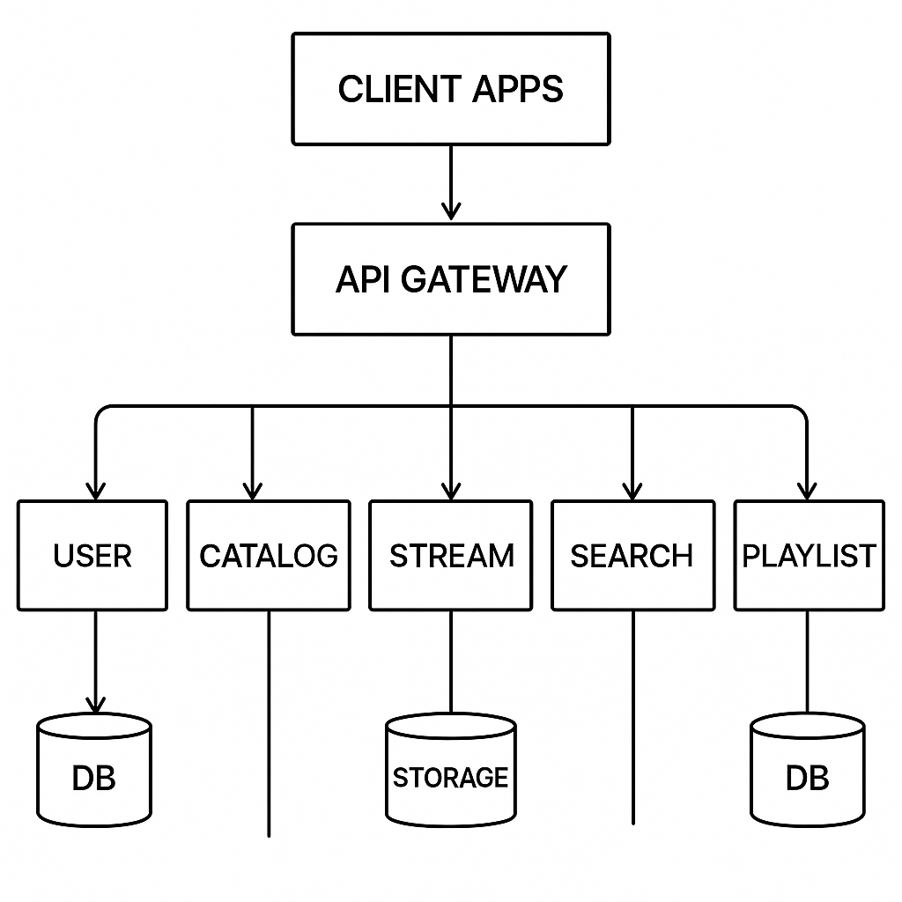

# Podcast Streaming Microservices

## Overview
A scalable podcast streaming platform built with microservices architecture.

## Architecture

- **User Service:** Handles registration and authentication.
- **Podcast Catalog Service:** Manages podcast metadata.
- **Streaming Service:** Delivers audio files.
- **Search Service:** Enables search functionality.
- **Playlist Service:** Manages user playlists.
- **API Gateway:** Routes client requests to services.

## Tech Stack
- C, Go, Rust, Docker, Kubernetes, PostgreSQL, MinIO (object storage)

## Getting Started
1. Clone the repo
2. Build Docker images
3. Start with `docker-compose up` or deploy to Kubernetes

## Database Setup

To initialize the database and tables, run:

psql -U postgres -f setup.sql

## API Endpoints
- `/users/register` - Register new user
- `/podcasts` - List podcasts
- `/stream/{episode}` - Stream audio

## Contributing
PRs welcome!
